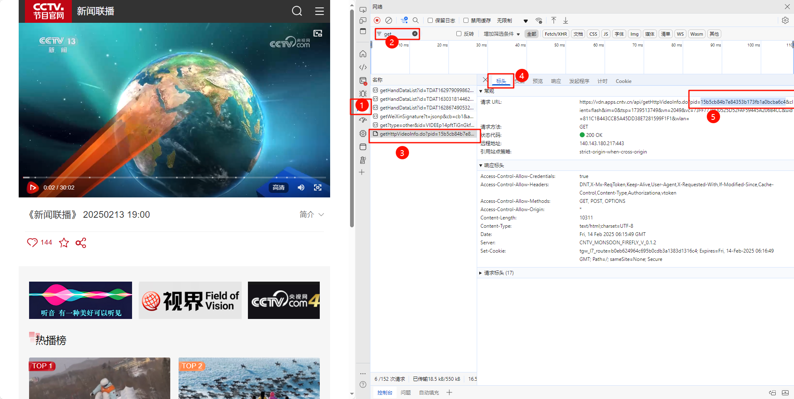

# 视频处理工具

一个基于 Flask 的视频处理工具，支持 TS 文件合并和 CCTV 视频下载功能。提供友好的 Web 界面，支持实时进度显示和任务管理。

## 功能特点

### TS 文件合并
- 支持多文件拖拽上传
- 自动排序合并
- 实时进度显示
- 支持大文件处理
- 合并状态实时反馈
- 支持失败重试

### CCTV 视频下载
- 支持通过 PID 下载视频
- 多线程并发下载
- 断点续传支持
- 失败重试机制
- 任务持久化存储
- 详细的下载进度显示
- 片段信息统计

### 任务管理系统
- 任务状态实时更新
- 详细的任务信息展示
- 支持任务删除和重试
- 片段级别的状态管理
- 下载速度和进度统计
- 文件大小和耗时统计

## 技术栈

### 后端
- Python 3.8+
- Flask 2.0.1
- FFmpeg

### 前端
- Bootstrap 5
- jQuery 3.6.0
- Bootstrap Icons
- Animate.css

## 安装说明

1. 创建并激活虚拟环境：

Windows:

    python -m venv venv
    venv\Scripts\activate

Linux/Mac:

    python3 -m venv venv
    source venv/bin/activate

2. 安装依赖：

    pip install -r requirements.txt

3. 安装 FFmpeg：

Linux:

    sudo apt update
    sudo apt install ffmpeg

macOS:

    brew install ffmpeg

4. 创建必要目录：

    mkdir uploads merged

5. 运行应用：

    python app.py

## 使用说明

### TS 文件合并
1. 点击"选择文件"或拖拽文件到上传区域
2. 选择需要合并的 TS 文件
3. 点击"开始合并"
4. 等待合并完成后下载

### CCTV 视频下载
1. 访问 CCTV 视频页面
2. 在开发者工具中找到视频 PID：
   - 按 F12 打开开发者工具
   - 按照下图步骤找到 PID：
     
     
     1. 点击"网络"(Network)标签
     2. 在过滤器中选择"XHR"
     3. 找到包含"getHttpVideoInfo.do"的请求
     4. 点击"标头"(Headers)标签
     5. 在URL中找到pid参数值
   
   - 复制找到的 32 位字符串
3. 将 PID 复制到输入框
4. 点击"开始下载"
5. 等待下载完成

## 配置说明

主要配置项在 app.py 中：

    MAX_CONTENT_LENGTH = 2GB  # 最大上传限制
    MAX_WORKERS = 8           # 下载线程数
    SEGMENT_TIMEOUT = 30      # 片段下载超时时间(秒)
    RETRY_LIMIT = 3          # 重试次数限制

## 故障排除

### 常见问题
1. ModuleNotFoundError
   ```bash
   pip install -r requirements.txt
   ```

2. FFmpeg 未找到
   ```bash
   # 验证安装
   ffmpeg -version
   ```

3. 权限问题
   ```bash
   # Linux/macOS
   chmod +x run.sh
   ```

## 更新日志

### v1.1.0 (2024-02-20)
- 新增视频预览功能
- 优化任务管理界面
- 修复已知问题
- 性能优化

### v1.0.0 (2024-02-14)
- 首次发布

## 许可证

MIT License

## 免责声明

本工具仅供学习和研究使用，请遵守相关法律法规，尊重版权。

## 任务管理

- 已完成或出错的任务可以删除
- 下载失败的任务可以重试
- 任务进度实时显示
- 支持断点续传
- 自动清理过期任务

## 安全提示

1. 仅供个人学习使用
2. 请勿用于商业用途
3. 遵守相关法律法规
4. 注意保护版权

## 更新日志

### v1.0.0 (2024-02-14)
- 初始版本发布
- 支持TS文件合并
- 支持CCTV视频下载
- 任务管理系统
- 多线程下载
- 失败重试机制

## 许可证

本项目采用 MIT 许可证 